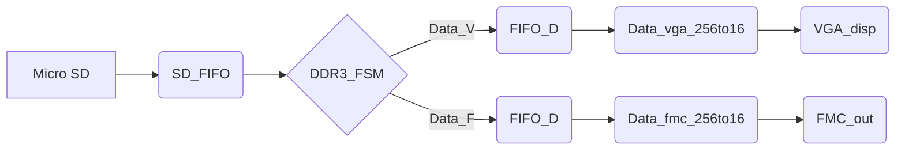

# 测试激励生成系统设计

作者：高育哲

时间：2019/10/22

## 工程简介

每个工程下面都有个readme，描述该工程包含的内容。

## 数据通路示意图


<center>
    <div style="color:orange; border-bottom: 1px solid #d9d9d9;
    display: inline-block;
    color: #111;
    padding: 2px;">图一 数据通路示意图</div>
</center>

- Micro SD每个扇区能够读出512byte，每个时钟周期输出16bit。
- SD_FIFO的数据位宽为256bit，深度为128位。
- DDR3的user interface时钟为200Mhz，数据位宽为256bit。PHY(physical layer)时钟为800Mhz，时钟上下沿均可采样，数据位宽为32位。数值对应关系为：200\*256=800\*2\*32。
- DDR3状态机中加入中断状态，进行两路独立的数据读出。
- FIFO_D由一大一小两个FIFO级联而成。大FIFO深度为256，小FIFO深度为128，数据位宽均为256bit。
- Data_256to16只要设计好流水线即可。

## 地址相关计算

### SD扇区读取次数和起始地址

> //512\*512/256 = 1024 一次读256个16bit
> //1024\*1024/256=4096
> //4096\*4096/256=65536
> //4096\*4096\*2/256=131072
> parameter  RD_SECTION_NUM  = RESOLUTION\*RESOLUTION*2/256

用winhex查看起始地址，修改PHOTO_SECCTION_ADDR0。

### DDR3读写长度计算

>assign  rd_burst_len=RESOLUTION\*RESOLUTION/(16\*4);//读单张图片,纵向4分之一采样，横向送到data_convert进行四分之一采样,所以横向的数据是完全读出来的，只有纵向的数据忽略了.4096\*4096采样成1024\*1024
>assign  rd_burst_len_full=RESOLUTION\*RESOLUTION\*2/16;
>assign  wr_burst_len=RESOLUTION\*RESOLUTION\*2/16;//65536 1<<21
>\16是因为16bit/(8\*32bit)

### 图片像素点对应的DDR3读取地址

因为有两张图像，每个像素点对应了两个读取地址。以下是用于计算的Python3小程序。

```python
while(True):  
    counter=int(input('counter='))
    print('counter=',counter)
    result=((counter)//256)*8192+((counter)%256)*8
    print('address1=',result)
    print('address2=',int(result+4096*4096/2))
```

## 验证

### 方法一：ILA核采样+Python处理(推荐)

在ILA核中，根据ddr_dout_256bit_full[255:0] 、 rd_burst_data_full、rd_burst_data_counter_full三个信号，利用capture和trigger功能，采集ddr3某一路的输出信号，保存为csv文件。随后用verify文件夹下的Python脚本进行验证。


```python
import re
import difflib
import sys
import string
addr_ori_1=r'C:\Users\gyz\Desktop\ddrtovga\test_photo\4k1.bin'
addr_ori_2=r'C:\Users\gyz\Desktop\ddrtovga\test_photo\4k2.bin'
addr_ori_all=r'addr_ori_all'
addr_4k1_out=r'4k1_out'
addr_4k2_out=r'4k2_out'

addr_ori_out_1=r'ori_out0_9999'
addr_ori_out_2=r'ori_out500000_509999'
addr_ori_out_3=r'ori_out1000000_1009999'
addr_ori_out_4=r'ori_out1500000_1509999'
addr_ori_out_5=r'ori_out2087152_2097151'


addr_fifo=r'fifoout0_9999.csv'
addr_fifo_out=r'fifo_out0_9999'
addr_ddr_1=r'ddr3out0_9999.csv'
addr_ddr_out_1=r'ddr_out0_9999'
addr_ddr_2=r'ddr3out500000_509999.csv'
addr_ddr_out_2=r'ddr_out500000_509999'
addr_ddr_3=r'ddr3out1000000_1009999.csv'
addr_ddr_out_3=r'ddr_out1000000_1009999'
addr_ddr_4=r'ddr3out1500000_1509999.csv'
addr_ddr_out_4=r'ddr_out1500000_1509999'
addr_ddr_5=r'ddr3out2087152_2097151.csv'
addr_ddr_out_5=r'ddr_out2087152_2097151'


ddr_fifo_diff_html=r'ddr_fifo_diff.html'
ddr_ori_diff1_html=r'ddr_ori_diff0_9999.html'
ddr_ori_diff2_html=r'ddr_ori_diff500000_509999.html'
ddr_ori_diff3_html=r'ddr_ori_diff1000000_1009999.html'
ddr_ori_diff4_html=r'ddr_ori_diff1500000_1509999.html'
ddr_ori_diff5_html=r'ddr_ori_diff2087152_2097151.html'
# addr_start=input('起始地址：')
start_addr=0


def data256(addr_in,addr_out,addr_start):
    with open(addr_out, 'wt') as f: 
        addr_counter=0;
        for line in open(addr_in):
            if re.match(r'^\d+,.*,.*',line):
                if addr_counter<10000:
                    # data256=re.split(r',',line)[13]
                    data256=re.match(r'.*,([0-9a-z]{64}),.*',line).group(1)
                    print('%s\t\t\t%s'%(addr_counter+addr_start,data256),file=f,end='\n')
                    addr_counter+=1;
                else:
                    break

def equ_judge(addr_1,addr_2):
        a=open(addr_1,'r').readlines()
        b=open(addr_2,'r').readlines()
        diff=difflib.ndiff(a,b)
        sys.stdout.writelines(diff)

def equ_judge_html(addr_1,addr_2,addr_html):
        a=open(addr_1,'r').readlines()
        b=open(addr_2,'r').readlines()
        diff = difflib.HtmlDiff()
        with open(addr_html, 'wt') as f: 
            print(diff.make_file(a,b),file=f)
def int2hex(num):
    if(len(hex(num))==3):
        return '0'+hex(num)[2:]
    else:
        return hex(num)[2:]
def bintohex(addr_in,addr_out,addr_start):
    print('起始的偏移地址为%s,对比范围是%s~%s'%(addr_start,addr_start,addr_start+9999))
    with open(addr_out, 'wt') as f: 
        counter=0;
        addr_counter=0
        data_str=''
        with open(addr_in, 'rb') as d:
            data = d.read()
            for item in data:
                if addr_counter<(addr_start):
                    if(counter==32):
                        addr_counter+=1;
                        if addr_counter==(addr_start):
                            data_str=int2hex(item)
                        counter=1
                    else:
                        counter+=1
                elif addr_counter<(10000+addr_start):
                    if(counter==32):
                        print('%s\t\t\t%s'%(addr_counter,data_str),file=f,end='\n')
                        addr_counter+=1;
                        data_str=int2hex(item)
                        counter=1
                    else:
                        data_str=data_str+int2hex(item)
                        counter+=1
                else:
                    break


def conbine(addr_in_1,addr_in_2,addr_out,):
    with open(addr_out, "ab") as myfile:
        with open(addr_in_1, "rb") as file2:
            myfile.write(file2.read())
        with open(addr_in_2, "rb") as file2:
            myfile.write(file2.read())

#----------------------------------------
#execute only one time
conbine(addr_ori_1,addr_ori_2,addr_ori_all)
#----------------------------------------
#hex(num)可能会少一位，0x08会变成0x8
bintohex(addr_ori_all,addr_ori_out_1,0)
bintohex(addr_ori_all,addr_ori_out_2,500000)
bintohex(addr_ori_all,addr_ori_out_3,1000000)
bintohex(addr_ori_all,addr_ori_out_4,1500000)
bintohex(addr_ori_all,addr_ori_out_5,2087152)

data256(addr_fifo,addr_fifo_out,0)
data256(addr_ddr_1,addr_ddr_out_1,0)
data256(addr_ddr_2,addr_ddr_out_2,500000)
data256(addr_ddr_3,addr_ddr_out_3,1000000)
data256(addr_ddr_4,addr_ddr_out_4,1500000)
data256(addr_ddr_5,addr_ddr_out_5,2087152)

equ_judge_html(addr_ddr_out_1,addr_fifo_out,ddr_fifo_diff_html)
#0~104_8575 4k1
#104_8576~ 2097151 4k2
equ_judge_html(addr_ddr_out_1,addr_ori_out_1,ddr_ori_diff1_html)
equ_judge_html(addr_ddr_out_2,addr_ori_out_2,ddr_ori_diff2_html)
equ_judge_html(addr_ddr_out_3,addr_ori_out_3,ddr_ori_diff3_html)
equ_judge_html(addr_ddr_out_4,addr_ori_out_4,ddr_ori_diff4_html)
equ_judge_html(addr_ddr_out_5,addr_ori_out_5,ddr_ori_diff5_html)
        
```


### 方法二：UART串口输出

工程中包含了uart的相关模块。如需使用，只需取消注释design for Uart的相关模块，并且更改fifo_data_full的读使能和读取时钟即可。uart使用的时钟是10Mhz， 波特率115000kps，8bit数据位，无校验位，1位停止位 。

但是使用这种验证数据的方式，存在以下缺点：

- 速度慢。
- PC端的调试助手接收大约2M的数据后就容易卡死。


## 图片转RGB565二进制文件

使用generatebin.m文件进行生成。gyz_color_recovery.m是1024\*1024分辨率下生成二进制并恢复成彩色图案的示例程序。

**generatebin.m**

```matlab
clc
clear
inputaddr='C:\Users\gyz\Desktop\ddrtovga\test_photo\8k2.jpg';
pngaddr='.\test_photo\4k2.png';
binaddr='.\test_photo\4k2.bin'
pictest =imread(inputaddr);
figure(4)
imshow(pictest)
picout=uint16([]);


% -----------------------------------------------color------------------------------------
a=0;
for j=1:4096
    for i=1:4096           picout(i,j)=bitshift(bitshift(uint16(pictest(i+a,j+a,1)),-3),11)+bitshift(bitshift(uint16(pictest(i+a,j+a,2)),-2),5)+bitshift(uint16(pictest(i+a,j+a,3)),-3);  
    end
end


% main 
figure(5)
imshow(picout);
imwrite(picout,pngaddr,'bitdepth',16);
fid1 = fopen(binaddr,'wb');%b is default method
picout2=picout';
    fwrite(fid1,picout2,'uint16','ieee-be'); %5,6,5
fclose(fid1);

```

## 输出引脚

### FMC引脚


|    信号名    | 引脚 |      注释      |
| :----------: | :--: | :------------: |
| fmc_data[0]  | F21  | fmc_data[15:0] |
| fmc_data[1]  | E21  |                |
| fmc_data[2]  | F17  |                |
| fmc_data[3]  | G17  |                |
| fmc_data[4]  | A22  |                |
| fmc_data[5]  | B22  |                |
| fmc_data[6]  | A28  |                |
| fmc_data[7]  | B28  |                |
| fmc_data[8]  | A27  |                |
| fmc_data[9]  | B27  |                |
| fmc_data[10] | B24  |                |
| fmc_data[11] | C24  |                |
| fmc_data[12] | D18  |                |
| fmc_data[13] | D17  |                |
| fmc_data[14] | A21  |                |
| fmc_data[15] | A20  |                |
|  fmc_hsync   | M23  |     行消隐     |
|  fmc_vsync   | M22  |     帧消隐     |
|   frm_cnt    | G27  |    哪张图片    |

### DDR3引脚

```
NET   "ddr3_addr[0]"                           LOC = "AC12"  |    |     VCCAUX_IO = HIGH        ;
NET   "ddr3_addr[10]"                          LOC = "AB8"   |    |     VCCAUX_IO = HIGH        ;
NET   "ddr3_addr[11]"                          LOC = "AA8"   |    |     VCCAUX_IO = HIGH        ;
NET   "ddr3_addr[12]"                          LOC = "AB12"  |    |     VCCAUX_IO = HIGH        ;
NET   "ddr3_addr[13]"                          LOC = "AA12"  |    |     VCCAUX_IO = HIGH        ;
NET   "ddr3_addr[14]"                          LOC = "AH9"   |    |     VCCAUX_IO = HIGH        ;
NET   "ddr3_addr[1]"                           LOC = "AE8"   |    |     VCCAUX_IO = HIGH        ;
NET   "ddr3_addr[2]"                           LOC = "AD8"   |    |     VCCAUX_IO = HIGH        ;
NET   "ddr3_addr[3]"                           LOC = "AC10"  |    |     VCCAUX_IO = HIGH        ;
NET   "ddr3_addr[4]"                           LOC = "AD9"   |    |     VCCAUX_IO = HIGH        ;
NET   "ddr3_addr[5]"                           LOC = "AA13"  |    |     VCCAUX_IO = HIGH        ;
NET   "ddr3_addr[6]"                           LOC = "AA10"  |    |     VCCAUX_IO = HIGH        ;
NET   "ddr3_addr[7]"                           LOC = "AA11"  |    |     VCCAUX_IO = HIGH        ;
NET   "ddr3_addr[8]"                           LOC = "Y10"   |    |     VCCAUX_IO = HIGH        ;
NET   "ddr3_addr[9]"                           LOC = "Y11"   |    |     VCCAUX_IO = HIGH        ;
NET   "ddr3_ba[0]"                             LOC = "AE9"   |    |     VCCAUX_IO = HIGH        ;
NET   "ddr3_ba[1]"                             LOC = "AB10"  |    |     VCCAUX_IO = HIGH        ;
NET   "ddr3_ba[2]"                             LOC = "AC11"  |    |     VCCAUX_IO = HIGH        ;
NET   "ddr3_cas_n"                             LOC = "AF11"  |    |     VCCAUX_IO = HIGH        ;
NET   "ddr3_ck_n[0]"                           LOC = "AC9"   |    |     VCCAUX_IO = HIGH        ;
NET   "ddr3_ck_p[0]"                           LOC = "AB9"   |    |     VCCAUX_IO = HIGH        ;
NET   "ddr3_cke[0]"                            LOC = "AJ9"   |    |     VCCAUX_IO = HIGH        ;
NET   "ddr3_cs_n[0]"                           LOC = "AH12"  |    |     VCCAUX_IO = HIGH        ;
NET   "ddr3_dm[0]"                             LOC = "AD4"   |    |     VCCAUX_IO = HIGH        ;
NET   "ddr3_dm[1]"                             LOC = "AF3"   |    |     VCCAUX_IO = HIGH        ;
NET   "ddr3_dm[2]"                             LOC = "AH4"   |    |     VCCAUX_IO = HIGH        ;
NET   "ddr3_dm[3]"                             LOC = "AF8"   |    |     VCCAUX_IO = HIGH        ;
NET   "ddr3_dq[0]"                             LOC = "AD3"   |    |     VCCAUX_IO = HIGH        ;
NET   "ddr3_dq[10]"                            LOC = "AF1"   |    |     VCCAUX_IO = HIGH        ;
NET   "ddr3_dq[11]"                            LOC = "AE4"   |    |     VCCAUX_IO = HIGH        ;
NET   "ddr3_dq[12]"                            LOC = "AE3"   |    |     VCCAUX_IO = HIGH        ;
NET   "ddr3_dq[13]"                            LOC = "AE5"   |    |     VCCAUX_IO = HIGH        ;
NET   "ddr3_dq[14]"                            LOC = "AF5"   |    |     VCCAUX_IO = HIGH        ;
NET   "ddr3_dq[15]"                            LOC = "AF6"   |    |     VCCAUX_IO = HIGH        ;
NET   "ddr3_dq[16]"                            LOC = "AJ4"   |    |     VCCAUX_IO = HIGH        ;
NET   "ddr3_dq[17]"                            LOC = "AH6"   |    |     VCCAUX_IO = HIGH        ;
NET   "ddr3_dq[18]"                            LOC = "AH5"   |    |     VCCAUX_IO = HIGH        ;
NET   "ddr3_dq[19]"                            LOC = "AH2"   |    |     VCCAUX_IO = HIGH        ;
NET   "ddr3_dq[1]"                             LOC = "AC2"   |    |     VCCAUX_IO = HIGH        ;
NET   "ddr3_dq[20]"                            LOC = "AJ2"   |    |     VCCAUX_IO = HIGH        ;
NET   "ddr3_dq[21]"                            LOC = "AJ1"   |    |     VCCAUX_IO = HIGH        ;
NET   "ddr3_dq[22]"                            LOC = "AK1"   |    |     VCCAUX_IO = HIGH        ;
NET   "ddr3_dq[23]"                            LOC = "AJ3"   |    |     VCCAUX_IO = HIGH        ;
NET   "ddr3_dq[24]"                            LOC = "AF7"   |    |     VCCAUX_IO = HIGH        ;
NET   "ddr3_dq[25]"                            LOC = "AG7"   |    |     VCCAUX_IO = HIGH        ;
NET   "ddr3_dq[26]"                            LOC = "AJ6"   |    |     VCCAUX_IO = HIGH        ;
NET   "ddr3_dq[27]"                            LOC = "AK6"   |    |     VCCAUX_IO = HIGH        ;
NET   "ddr3_dq[28]"                            LOC = "AJ8"   |    |     VCCAUX_IO = HIGH        ;
NET   "ddr3_dq[29]"                            LOC = "AK8"   |    |     VCCAUX_IO = HIGH        ;
NET   "ddr3_dq[2]"                             LOC = "AC1"   |    |     VCCAUX_IO = HIGH        ;
NET   "ddr3_dq[30]"                            LOC = "AK5"   |    |     VCCAUX_IO = HIGH        ;
NET   "ddr3_dq[31]"                            LOC = "AK4"   |    |     VCCAUX_IO = HIGH        ;
NET   "ddr3_dq[3]"                             LOC = "AC5"   |    |     VCCAUX_IO = HIGH        ;
NET   "ddr3_dq[4]"                             LOC = "AC4"   |    |     VCCAUX_IO = HIGH        ;
NET   "ddr3_dq[5]"                             LOC = "AD6"   |    |     VCCAUX_IO = HIGH        ;
NET   "ddr3_dq[6]"                             LOC = "AE6"   |    |     VCCAUX_IO = HIGH        ;
NET   "ddr3_dq[7]"                             LOC = "AC7"   |    |     VCCAUX_IO = HIGH        ;
NET   "ddr3_dq[8]"                             LOC = "AF2"   |    |     VCCAUX_IO = HIGH        ;
NET   "ddr3_dq[9]"                             LOC = "AE1"   |    |     VCCAUX_IO = HIGH        ;
NET   "ddr3_dqs_n[0]"                          LOC = "AD1"   |    |     VCCAUX_IO = HIGH        ;
NET   "ddr3_dqs_n[1]"                          LOC = "AG3"   |    |     VCCAUX_IO = HIGH        ;
NET   "ddr3_dqs_n[2]"                          LOC = "AH1"   |    |     VCCAUX_IO = HIGH        ;
NET   "ddr3_dqs_n[3]"                          LOC = "AJ7"   |    |     VCCAUX_IO = HIGH        ;
NET   "ddr3_dqs_p[0]"                          LOC = "AD2"   |    |     VCCAUX_IO = HIGH        ;
NET   "ddr3_dqs_p[1]"                          LOC = "AG4"   |    |     VCCAUX_IO = HIGH        ;
NET   "ddr3_dqs_p[2]"                          LOC = "AG2"   |    |     VCCAUX_IO = HIGH        ;
NET   "ddr3_dqs_p[3]"                          LOC = "AH7"   |    |     VCCAUX_IO = HIGH        ;
NET   "ddr3_odt[0]"                            LOC = "AK9"   |    |     VCCAUX_IO = HIGH        ;
NET   "ddr3_ras_n"                             LOC = "AE11"  |    |     VCCAUX_IO = HIGH        ;
NET   "ddr3_reset_n"                           LOC = "AG5"   |    |     VCCAUX_IO = HIGH        ;
NET   "ddr3_we_n"                              LOC = "AG13"  |    |     VCCAUX_IO = HIGH        ;
```

### Micro SD引脚

```
## MICRO SD CARD
set_property -dict {PACKAGE_PIN T30 IOSTANDARD LVCMOS33} [get_ports sd_cs]
set_property -dict {PACKAGE_PIN R29 IOSTANDARD LVCMOS33} [get_ports sd_mosi]
set_property -dict {PACKAGE_PIN R26 IOSTANDARD LVCMOS33} [get_ports sd_miso]
set_property -dict {PACKAGE_PIN R28 IOSTANDARD LVCMOS33} [get_ports sd_clk]
```

### VGA引脚

```
## VGA Connector
set_property -dict {PACKAGE_PIN AH20 IOSTANDARD LVCMOS33} [get_ports {vga_b[0]}]
set_property -dict {PACKAGE_PIN AG20 IOSTANDARD LVCMOS33} [get_ports {vga_b[1]}]
set_property -dict {PACKAGE_PIN AF21 IOSTANDARD LVCMOS33} [get_ports {vga_b[2]}]
set_property -dict {PACKAGE_PIN AK20 IOSTANDARD LVCMOS33} [get_ports {vga_b[3]}]
set_property -dict {PACKAGE_PIN AG22 IOSTANDARD LVCMOS33} [get_ports {vga_b[4]}]

set_property -dict {PACKAGE_PIN AJ23 IOSTANDARD LVCMOS33} [get_ports {vga_g[0]}]
set_property -dict {PACKAGE_PIN AJ22 IOSTANDARD LVCMOS33} [get_ports {vga_g[1]}]
set_property -dict {PACKAGE_PIN AH22 IOSTANDARD LVCMOS33} [get_ports {vga_g[2]}]
set_property -dict {PACKAGE_PIN AK21 IOSTANDARD LVCMOS33} [get_ports {vga_g[3]}]
set_property -dict {PACKAGE_PIN AJ21 IOSTANDARD LVCMOS33} [get_ports {vga_g[4]}]
set_property -dict {PACKAGE_PIN AK23 IOSTANDARD LVCMOS33} [get_ports {vga_g[5]}]

set_property -dict {PACKAGE_PIN AK25 IOSTANDARD LVCMOS33} [get_ports {vga_r[0]}]
set_property -dict {PACKAGE_PIN AG25 IOSTANDARD LVCMOS33} [get_ports {vga_r[1]}]
set_property -dict {PACKAGE_PIN AH25 IOSTANDARD LVCMOS33} [get_ports {vga_r[2]}]
set_property -dict {PACKAGE_PIN AK24 IOSTANDARD LVCMOS33} [get_ports {vga_r[3]}]
set_property -dict {PACKAGE_PIN AJ24 IOSTANDARD LVCMOS33} [get_ports {vga_r[4]}]

set_property -dict {PACKAGE_PIN AF20 IOSTANDARD LVCMOS33} [get_ports vga_hsync]
set_property -dict {PACKAGE_PIN AG23 IOSTANDARD LVCMOS33} [get_ports vga_vsync]
```

### UART 引脚

```
##UART
set_property -dict {PACKAGE_PIN Y23 IOSTANDARD LVCMOS33} [get_ports o_Tx_Serial]
```


## 个人总结
**下面是对这项工作的总结：**

**1.为了避免系统启动初期，DDR还在初始化，后续的FIFO被写满造成丢数据的情况，每次SD卡每读七个扇区就要停下来等待SD_FIFO被读空。512 byte,512\*8/(256)\*7=112正好小于设的fifo深度**

**2.FIFO_D由两级一大一小的FIFO组成，这是因为DDR3的读出具有一定的滞后性，如果后续的缓存满了，DDR不能立刻停止读出，此时就会造成数据的丢失。因此每次使DDR读取固定长度的数据写到小FIFO中，等到小FIFO被读空后继续读取固定长度的数据写到小FIFO中。后一级的大FIFO的作用是，在等待期间数据流不会中断。**

**3.DDR3读取过程中可能存在某一路读出速度过慢，造成数据丢失。因此需要在某个状态加入刷新操作。**

**4.从存储器A读数据往存储B写数据，之间的交互规律可以归纳为一个规则。令A的可读信号为a_enable,令B的可写信号为b_enable.（对DDR3来说就是app_wdf_rdy app_rdy,对FIFO来说就是empty和full）。**

- 如果A是读出延迟较大或者工作在burst模式需要连续读出的存储器，比如DDR，SD(存疑，因为梁峰学生的程序里一次读出一个扇区512Byte，我没改sd的接口部分，按照网上的资料，spi模式下按照字节读出，发送CMD17读取单个扇区。发送了CMD17之后，应该收到回应0x00。之后，MCU应该不停读取，直到读到0xFE，这个是数据开始的标志。0xFE之后的512字节就是扇区的原始数据了。读完512字节的数据之后，还需要读取2字节的CRC），可以设置一个计数器，写固定的数到B，然后等B读空后再往里写，防止出现B写满数据丢失的情况。

- 如果给出读信号后的下一个时钟周期，A的数据总线上就能够输出有效数据，比如fifo，就应该这么写。最坏的情况就是第一个时钟上升沿向A发出读信号，第二个时钟沿读出数据有效，但是b_enable因为前一个数据写入变低，此时采样到的仍然是高电平，所以b_wr_en_r被赋值为a_rd_en，用于保持。此时b_wr_en变为低。第三个始终上升沿，b_wr_en变高将数据写入，因为第二个上升沿没有给出读信号，因此数据总线上的数据并没有变化。
  wire a_rd_en , b_wr_en;
  reg b_wr_en_r;
  assign a_rd_en=(a_enable & b_enable)?1:0;
  always @(posedge clk, negedge rst_n)
  begin
   if(~rst_n)
    b_wr_en_r<=0;
   else if(b_enable)
    b_wr_en_r<=a_rd_en;
  end
  assign b_wr_en=(b_enable)?b_wr_en_r:0;

**5.在设计流水线的时候，把属于不同clock stage的信号都列出来，不容易出bug。**

**6.建立时间的问题。ui_clk是pll的输入，sd_clk和vga_clk是pll的输出。如果把ddr3的初始化信号（属于ui_clk时钟域）和rst_n相与，作为sd_clk和vga_clk时钟域的异步复位信号，时序报错，建立时间不满足。解决办法是：

>sd_clk是ui_clk的四分频，用计数器分频即可。
vga_clk不是整数。网上貌似有小数分频？我没太看懂。我最后拿属于同一个时钟域的FIFO(2st stage)的empty信号和rst_n相与，作为vga和256to16模块的复位。**

**7.ddr3读写的问题。app_en代表地址总线有效，app_wdf_en代表数据总线有效，之前我以为ddr写的时候，可以把app_en一直置1，app_wdf_en变化即可。但后来发现ddr的读出不对，经常随机丢数据。然后我才意识到，可能ddr的ip核里包含了一些FIFO，如果地址总线一直有效，可能传递进去的地址被放在fifo末尾，并不是真正使用的地址。改成assign app_en=app_wdf_en就好了**


